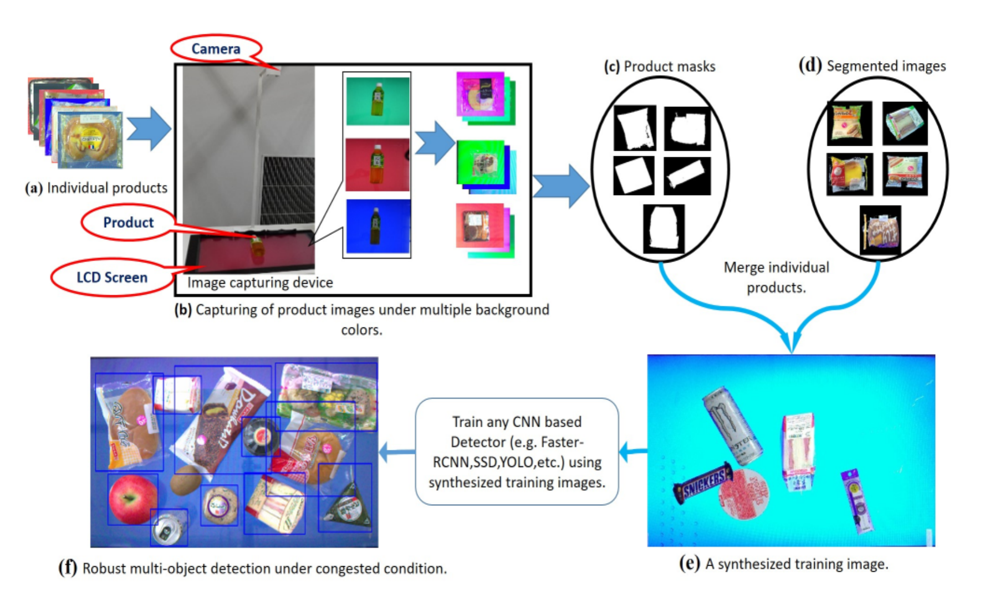
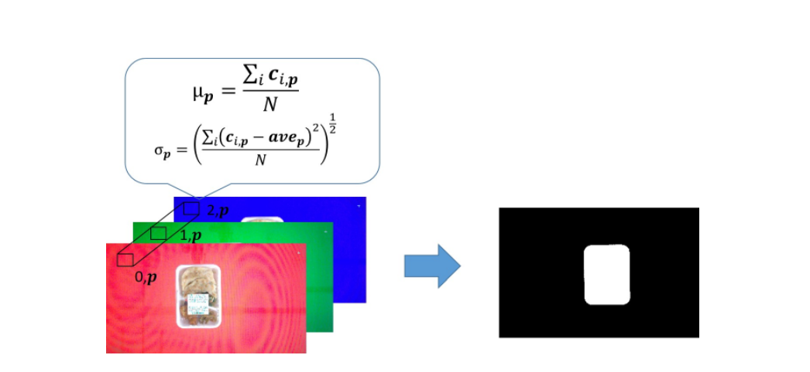
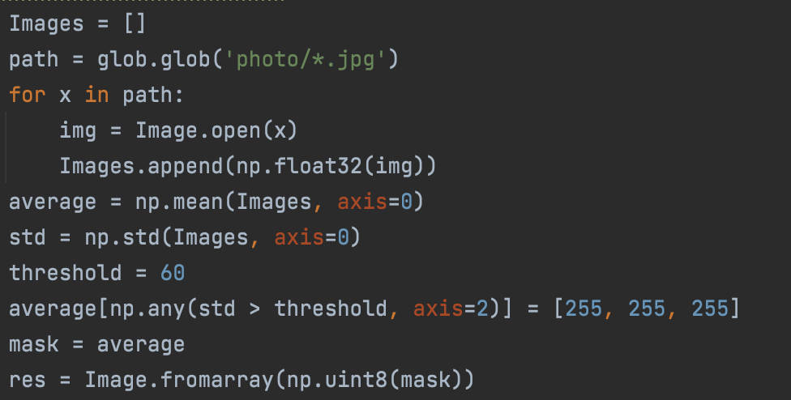
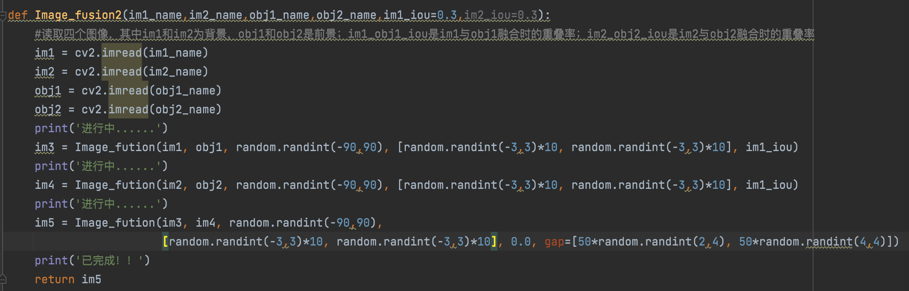

## 核心算法

### PART1 整体算法

整体流程如图所示：

### PART2 掩膜提取的核心算法

掩膜提取的核心算法主要是根据不同背景相同产品的几张图片计算像素平均值。根据像素平均值计算像素标准偏差，并且生成标准偏差图像(MSTD)。之后进行阈值处理操作，获得精确的掩膜。

算法图示如下：

算法的核心代码如下：

阈值是我调试与观察选择的值，效果是可行的。

在阈值操作中，我们是将阈值之上的值直接保留，阈值之下的值变为白色，这样可以直接获得一个白色背景的产品。

### PART3 生成合成图像的核心算法

论文中只提及了生成合成图像的概念方法，没有提及如何实现。大致目标为根据提取的掩膜将它们合成在一张图像上，在这个过程中设计一个Overlap Index，根据自己选定的重叠值生成的图像的重叠率也要有所改变，重叠率主要是通过IoU来计算，如果生成图像重叠率比设计重叠值小则移动一个物体靠近另一个物体，如果生成图像重叠率比设计重叠值大则移动一个物体远离另一个物体，从而保证重叠率为一个定值。

根据这个大致描述，进行自己的实现。本融合算法的思路是，对四个图像分为两组；首先对每组图像进行融合，然后对融合之后的两个图像进行融合，得到最终的结果。

首先是每组图像间的融合然后是两组图像的融合：

融合算法的步骤如下所示：(一张为背景、一张为前景)

1、 输入背景im、前景obj、obj的旋转角度angle、obj的移动方向vection、im与obj的重叠率iou。

2、 将im扩展为9000*9000的图像。

3、 截取obj中的物体，并旋转angle角度。

4、 计算im与obj的重叠率。

5、 如果im与obj的重叠率小于等于iou,转向步骤7。

6、 如果im与obj的重叠率大于iou，将obj按照vection方向进行移动；然后转向步骤4和5。

7、 输出融合结果。

在第三步融合时将两者直接的IoU设置为0，这样的话两组图像融合是IoU是可以确定的。

### PART4 创新

第一个算法通过精确的掩膜提取让模型训练更加准确，这样的方法更加自动化，减少人工成本。

第二个算法通过设置不同的重叠值可以控制生成的图像的识别难度，以达到评估、训练和测试的目的。
